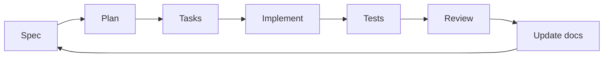

# Architecture

## Purpose

This repository defines a lightweight, installable scaffold for Spec Driven Development combined with Agile.

The framework is intentionally small so it can be reused across projects without creating context bloat.

## Core Design

- Markdown-first documentation.
- Specs separated by functionality and epic.
- Small, reusable skills instead of large prompts.
- Lean context loading: each agent reads only what it needs.
- Docs are the source of truth.
- External capabilities are added through MCP when needed.
- A CLI or create-style command generates the scaffold into another project.

## Repository Layers

- `AGENTS.md`: constitution and navigation rules for agents.
- `docs/`: architecture and roadmap.
- `specs/`: project-wide specs plus per-epic specs, plans, and tasks for the scaffold product itself.
- `templates/`: files that will be copied or rendered into the target project.
- `cli/` or `src/`: installer and scaffold command implementation.
- `skills/` or external skill storage: reusable agent helpers, kept small.
- MCP integrations: optional tools for external systems.

## Workflow Model

## Governance

- Developers own Git flow and release decisions.
- Agents can assist with planning, implementation, testing, and review.
- Any meaningful scope or behavior change must be reflected in docs first.

## Current Stack

This repository is a framework product, so the application stack is the tooling stack for the generator itself.

The only fixed stack assumptions are:

- Markdown for docs.
- Git for version control.
- Node.js package distribution, with Bun compatibility where practical.
- MCP where external integration is useful.
