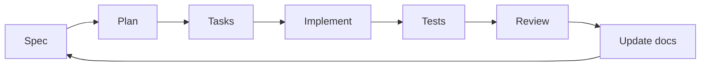

# Architecture

## Purpose

This project is a lightweight scaffold for Spec Driven Development combined with Agile.

## Core Design

- Markdown-first documentation.
- Specs separated by functionality and epic.
- Small, reusable skills instead of large prompts.
- Lean context loading: each agent reads only what it needs.
- Docs are the source of truth.
- External capabilities are added through MCP when needed.

## Repository Layers

- `AGENTS.md`: constitution and navigation rules for agents.
- `docs/`: architecture and roadmap.
- `specs/`: project-wide specs plus per-epic specs, plans, and tasks.
- `skills/` or external skill storage: reusable agent helpers, kept small.
- MCP integrations: optional tools for external systems.

## Workflow Model

## Governance

- Developers own Git flow and release decisions.
- Agents can assist with planning, implementation, testing, and review.
- Any meaningful scope or behavior change must be reflected in docs first.

